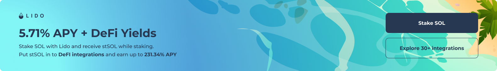

# Lido on Solana - Frontend SDK

### About us

Lido on Solana is a Lido-DAO governed liquid staking protocol for the Solana blockchain. Anyone who stakes their SOL tokens with Lido will be issued an on-chain representation of SOL staking position with Lido validators, called <strong>stSOL</strong>. We will work to integrate stSOL widely into the Solana DeFi ecosystem to enable stSOL users to make use of their staked assets in a variety of applications.

Lido on Solana gives you:
- **Liquidity** — No delegation/activation delays and the ability to sell your staked tokens
- **One-click staking** — No complicated steps
- **Decentralized** security — Assets spread across the industry’s leading validators chosen by the Lido DAO

### About sdk

This sdk helps you integrate with us, using two ways:
- Simplest way is using React banner.
- Support staking widget in your project. We provide js functions for staking, unstaking, showing DeFI pools, etc.

## Contents:
- [Installation](#installation)
- [Using banner](#using-banner)
- [Using staking widget](#using-staking-widget)
- [Learn more](#learn-more)

## Installation
```bash
$ npm install @lidofinance/solido-sdk
$ yarn add @lidofinance/solido-sdk
```

## Using banner



```ts
import { LidoStakeBanner } from '@lidofinance/solido-sdk';

<LidoStakeBanner referrerId="your_solana_referral_address" direction="horizontal" />
```

_Note: also available vertical mode._

## Using staking widget

In progress, will be available soon.

## Learn more
- [Lido on Solana](https://solana.lido.fi/)
- [Docs](https://docs.solana.lido.fi/)
- [Lido Referral Program for Solana](https://help.lido.fi/en/articles/5847184-lido-referral-program-for-solana-integration-guide)
- [Join on Discord](https://discord.gg/vgdPfhZ)
- [Join on Telegram](https://t.me/lidofinance)
